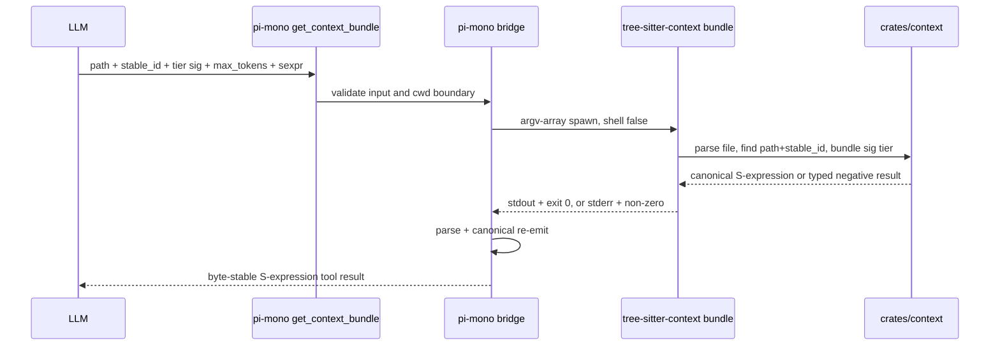
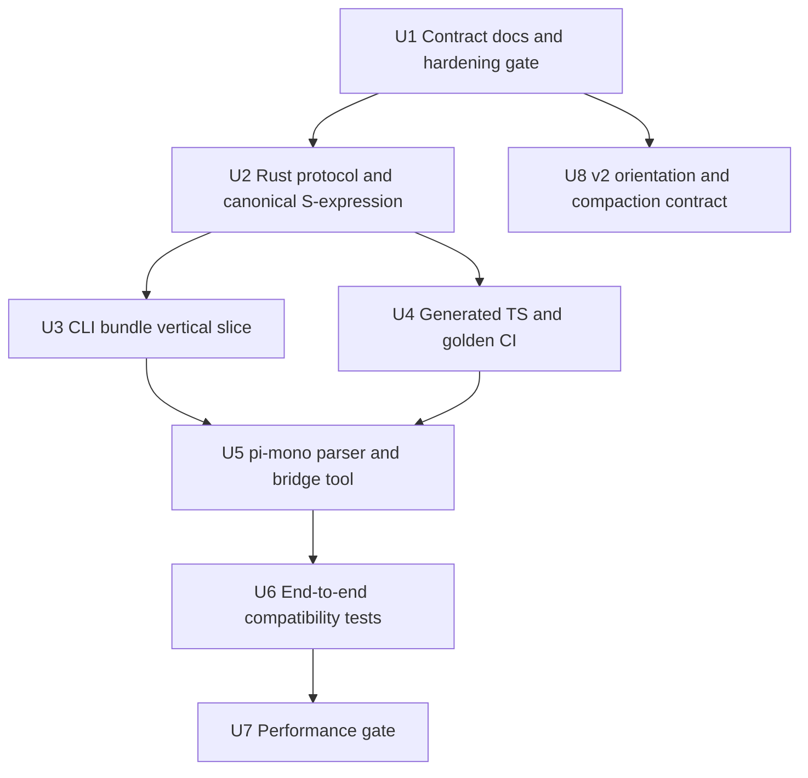
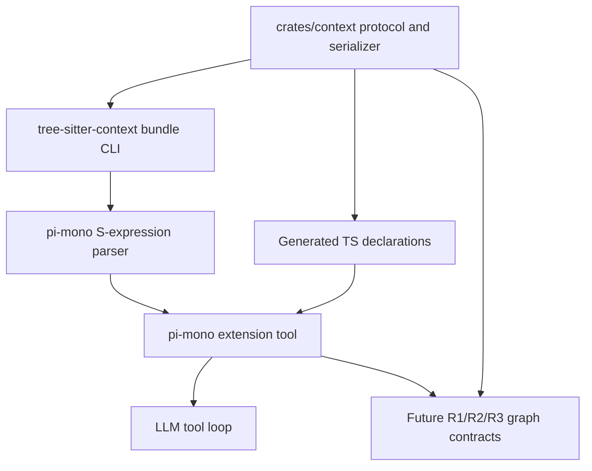

# feat: Add R0 context firewall vertical slice

## Overview

This plan turns the R0 Agent Interface Contract / Context Firewall requirements into an implementation sequence for a real v1 vertical slice: `get_context_bundle(path, stable_id, tier:"sig", max_tokens, output_format:"sexpr")` flows from pi-mono to a Rust CLI, returns canonical S-expression bytes, is parsed and re-emitted by pi-mono, and exposes typed negative signals instead of opaque text fallback.

The work deliberately stays narrow. R0 v1 proves the contract with a single-file, single-tool path and locks the future graph/orientation/compaction schema so R1/R2/R3 can implement against it later. It does not build the graph, daemon, MCP server, cross-file resolver, or graph-aware compaction runtime (see origin: docs/brainstorms/2026-04-26-r0-context-firewall-requirements.md).

**Target repos:** current tree-sitter checkout plus the nested pi-mono checkout under `pi-mono/`. File paths below are relative to this workspace.

---

## Problem Frame

pi-mono currently exposes file and shell tools but no code-structure primitive. Its compaction path still summarizes conversation history through an LLM, and tool outputs are plain text without stable handles. The R0 contract changes that posture by making pi-mono a consumer of deterministic tree-sitter-context bundles: S-expression serialization, `path + stable_id` addressing, typed negative results, provenance fields, and future graph-aware compaction boundaries.

The current tree-sitter context prototype already has useful single-file chunking, budget bundling, and CLI integration, and local code shows several hardening items are partially or fully present. R0 must still add a new S-expression bundle contract and a pi-mono bridge rather than assuming the existing JSON CLI is the agent-facing contract.

---

## Requirements Trace

- R1. Provide only the v1 primitive `get_context_bundle(path, stable_id, tier:"sig", max_tokens, output_format:"sexpr")`, scoped to a single file and addressed by `path + stable_id`.
- R2. Run against real `crates/context` data end to end: Rust parse, Rust S-expression output, pi-mono parse/canonical re-emit, LLM tool result.
- R3. Preserve honest token estimates; `estimated_tokens` must not be capped to the budget.
- R4. Return explicit negative signals for `not_found`, `ambiguous_stable_id`, and `exhausted`.
- R5. Define canonical S-expression form in `docs/plans/sexpr-canonical-form-v1.md`.
- R6. Add a lightweight pi-mono S-expression parser/canonicalizer and reject invalid Rust output with typed provenance errors.
- R7. Keep AstCell / Provenance / Bundle structs Rust-authored and generate TS declarations from Rust with `ts-rs` or an equivalent generator.
- R8. Add byte-level golden gates for Rust determinism and pi-mono parse/re-emit equality.
- R9. Spawn the CLI through argv arrays, validate all tool inputs, constrain paths to the cwd/repo root, and clamp token budgets.
- R10. Keep stdout success / non-zero stderr error semantics. Do not encode process errors as stdout S-expressions.
- R11. Do not change the existing `read/bash/edit/write/grep/find/ls` result schemas.
- R12. Measure cold and warm subprocess latency and real interaction call counts, then apply the three-tier daemon gate.
- R13. Verify the hardening prerequisites for `--budget`, `--quiet`, `--grammar-path`, and honest estimates before the bridge depends on them.
- R14. Freeze the v1 CLI contract for `tree-sitter-context bundle <path> --stable-id <id> --tier sig --format sexpr --max-tokens <n> --budget <n>`, including the relationship between `--max-tokens` and `--budget`.
- R15. Preserve the current `crates/context` single-file scope and emit `unknown_cross_file` instead of inventing cross-file behavior.
- R16-R17. Lock orientation block schema, lifecycle, and severe reorientation triggers for v2 without generating orientation in v1.
- R18-R21. Lock graph-aware compaction options, failure behavior, and `CompactionResult.details` schema for v2 without replacing pi-mono compaction in v1.
- R22-R26. Document R1 graph obligations: deterministic snapshot id, snapshot diff, `.tree-sitter-context-mcp/HEAD`, compaction queries, and typed graph errors.
- R27. Do not assume global `StableId` uniqueness; v1 uses `path + stable_id` and reports same-file ambiguity.

**Origin actors:** A1 pi-mono session runtime, A2 `tree-sitter-context` CLI, A3 LLM consumer, A4 future R1 graph builder, A5 pi-mono operator.

**Origin flows:** F1 real v1 single-tool call, F2 invalid Rust S-expression failure path, F3 v2 orientation injection contract, F4 v2 compaction trigger contract.

**Origin acceptance examples:** AE1 deterministic Rust and TS canonical bytes, AE2 `not_found`, AE3 invalid S-expression error, AE4 budget honesty, AE5 v2 graph-locked compaction failure, AE6 performance gate, AE7 generated TS drift detection, AE8 existing seven-tool compatibility, AE9 exhaustion signal, AE10 ambiguity signal, AE11 v2 orientation freshness, AE12 v2 reorientation diff, AE13 v2 compaction details and typed graph errors.

---

## Scope Boundaries

- No cross-file references or global stable-id lookup in v1.
- No graph builder, snapshot diff implementation, SQLite store, god nodes, community detection, Louvain, PageRank, or daemon.
- No MCP server, stdio JSON-RPC service, N-API bridge, or WASM bridge.
- No replacement or schema change for existing pi-mono `read/bash/edit/write/grep/find/ls` tools.
- No JSON bridge/parser/canonicalizer on the pi-mono side for v1; pi-mono consumes only `output_format:"sexpr"`.
- No graph-aware compaction runtime in v1; only schema and lifecycle contracts are locked.
- No orientation prompt injection in v1; only schema and freshness semantics are locked.
- No R3 primitives beyond `get_context_bundle`.

### Deferred to Follow-Up Work

- R1 graph build/update, `graph_snapshot_id`, `.tree-sitter-context-mcp/HEAD`, and snapshot diff APIs: separate R1 plan/PR.
- R2 AstCell and provenance expansion beyond the v1 bundle surface: separate R2 plan/PR after the generated-type path is proven.
- R3 query primitives such as call graph assertions, missing symbols, safe edit, shortest path, ranked architecture, and semantic diff: separate R3 planning.
- Daemon bridge: only promoted to v1.5 if the R12 latency gate fails or lands in the middle tier with operator approval.
- Actual pi-mono compaction replacement and orientation injection: v2 implementation after graph APIs exist.

---

## Context & Research

### Relevant Code and Patterns

- `crates/context/src/chunk.rs` now records true `estimated_tokens` and downgrades confidence on parse errors; R0 should verify this behavior against AE4 instead of reimplementing it.
- `crates/context/src/bundle.rs` already has included/omitted bundle records and budget totals; R0 should reuse its budget accounting and add the v1 stable-id selection and S-expression envelope.
- `crates/context/src/identity.rs` uses an explicit deterministic digest and duplicate-aware matching in local code; R0 still cannot assume global uniqueness and must keep `path + stable_id`.
- `crates/cli/src/context.rs` contains the current JSON `tree-sitter context` path and loader integration; it is the strongest local pattern for parsing files through `tree-sitter-loader`.
- `crates/cli/src/main.rs` wires `ContextCmd`, `--budget`, `--quiet`, and `--grammar-path`; R0 should add the dedicated `tree-sitter-context bundle` contract without breaking the existing experimental `tree-sitter context` command.
- `pi-mono/packages/coding-agent/src/core/extensions/types.ts` and `examples/extensions/hello.ts` show the extension tool registration shape.
- `pi-mono/packages/coding-agent/src/core/exec.ts` already provides argv-array, `shell:false` subprocess execution with stdout/stderr/code capture and abort/timeout support.
- `pi-mono/packages/coding-agent/src/core/tools/index.ts` defines the existing seven built-in tools; compatibility checks should prove R0 does not mutate their definitions or result schemas.
- `pi-mono/packages/coding-agent/src/core/compaction/compaction.ts` still calls LLM summarization through `compact()` and has the `CompactionResult.details` extension point needed by the v2 contract.
- `pi-mono/packages/coding-agent/src/core/system-prompt.ts` has `appendSystemPrompt` and `contextFiles` insertion points for future orientation, but v1 should not inject orientation.
- `pi-mono/AGENTS.md` requires no `any` unless necessary, no inline imports, package-root test execution for modified tests, and `npm run check` after code changes.

### Institutional Learnings

- `docs/solutions/workflow-issues/tree-sitter-context-branch-review-2026-04-25.md` identified three P1 risks that matter directly to R0: stable identity must be deterministic, duplicate stable IDs must not silently overwrite, and token estimates must be honest.
- `docs/plans/tree-sitter-context-hardening-implementation-plan-2026-04-25.md` is an active hardening plan. R0 must treat R3/R13/R27 as prerequisites or verified gates, not duplicate that plan's broader invalidation work.
- `docs/plans/tree-sitter-context-rfc-2026-04-24.md` originally preferred canonical JSON and display-only S-expressions. R0 is a pi-mono-specific integration contract that intentionally uses canonical S-expressions for the one v1 bridge surface; the plan keeps the older JSON CLI path unchanged.

### External References

- `ts-rs` supports `#[derive(TS)]`, `#[ts(export)]`, `#[ts(export_to = "...")]`, and programmatic export configuration; generated bindings are typically produced during `cargo test` or explicit export calls. Source: https://github.com/aleph-alpha/ts-rs/wiki/Deriving-the-TS-trait
- `Bun.spawn` supports array command syntax, cwd/env, stdout/stderr streams, `AbortSignal`, timeout, and exit-code promises. Source: https://github.com/oven-sh/bun/blob/main/docs/runtime/child-process.mdx

---

## Key Technical Decisions

- Add a dedicated `tree-sitter-context` binary entry under the CLI crate for the frozen R0 contract. Rationale: `crates/cli` already owns loader integration, while a standalone binary name matches the origin contract and avoids overloading the existing `tree-sitter context <file>` JSON command.
- Keep `--budget` as the included-chunk budget and `--max-tokens` as the bridge/operator result ceiling for the v1 CLI contract. Rationale: AE4 requires `--budget 500 --max-tokens 5000` to enforce a 500-token included-chunk budget while preserving true estimates for omitted oversized chunks.
- Keep Rust as the protocol source of truth and generate TypeScript declarations. Rationale: `ts-rs` can export Rust-derived TS files; CI can catch stale generated output by requiring generated artifacts to match the Rust source.
- Implement canonical S-expression serialization in Rust and canonical parse/re-emit in pi-mono. Rationale: both sides must prove byte stability; direct stdout passthrough would fail R6 and weaken prompt-cache guarantees.
- Represent tool-level failures as typed S-expressions returned by the bridge only after process success and parser validation. Process failures remain non-zero stderr per R10.
- Use existing pi-mono extension registration for `get_context_bundle`, not a built-in default tool. Rationale: R0 is opt-in and must not change the existing seven built-in tools or their default active set.
- Prefer pi-mono's existing argv-array `execCommand`/extension execution shape for v1, with a Bun-specific spawn backend only if implementation evidence shows it is needed. Rationale: the existing helper already satisfies shell-free semantics; R12 decides whether optimization or daemon work belongs in v1.5.
- Treat v2 orientation and compaction as contract documents plus type sketches, not runtime changes. Rationale: graph APIs do not exist yet; implementing runtime stubs would create misleading behavior.

---

## Open Questions

### Resolved During Planning

- Is `ts-rs` viable for the generated TypeScript constraint? Yes. It supports derive/export attributes, custom output paths, and programmatic export configuration. The implementation should still validate exact output layout in the current workspace.
- Can Bun spawn satisfy R9/R12 if pi-mono runs under Bun? Yes. Bun supports argv-array subprocesses, stdout/stderr streams, exit codes, abort signals, and timeouts. The plan still starts with the existing pi-mono process abstraction unless measurement says otherwise.
- Should v1 create a daemon? No. R12 makes the daemon a measured gate, not the default v1 architecture.
- Should R0 modify existing pi-mono tool schemas? No. AE8 requires byte-stable compatibility fixtures for the existing seven tools.

### Deferred to Implementation

- Exact Rust module names for `AstCell`, `Provenance`, and `Bundle`: choose during U2 while preserving the Rust-source/TS-generated boundary.
- Whether the dedicated `tree-sitter-context` binary should be a thin wrapper over `crates/cli/src/context.rs` or a small sibling module: decide during U3 based on minimal duplication and loader testability.
- Exact generated TS artifact path: choose during U2, but it must be generated from Rust and committed or checked in a way CI can detect drift.
- Exact implementation of the TS parser's R7RS string subset: U5 should keep the subset minimal and tested against the canonical-form document rather than generalizing into a full Lisp parser.

---

## Output Structure

```text
docs/plans/
  sexpr-canonical-form-v1.md
  tree-sitter-context-cli-v1-contract.md
  r0-orientation-compaction-v2-contract.md
  r0-context-firewall-performance-report-2026-04-26.md

crates/context/src/
  protocol.rs
  sexpr.rs

crates/context/tests/
  sexpr_contract.rs
  bundle_contract.rs

crates/cli/src/
  bin/tree-sitter-context.rs
  context.rs
  tests/context_bundle_test.rs

pi-mono/packages/coding-agent/src/core/tree-sitter-context/
  bridge.ts
  sexpr.ts
  tool.ts
  generated.ts

pi-mono/packages/coding-agent/examples/extensions/
  tree-sitter-context.ts

pi-mono/packages/coding-agent/test/
  tree-sitter-context-sexpr.test.ts
  tree-sitter-context-tool.test.ts
  tree-sitter-context-compat.test.ts
```

This tree is a scope declaration. The implementing agent may adjust exact file names if local module conventions point to a smaller layout, but the same responsibilities must remain covered.

---

## High-Level Technical Design

> *This illustrates the intended approach and is directional guidance for review, not implementation specification. The implementing agent should treat it as context, not code to reproduce.*



The v1 result envelope always includes provenance fields. Before R1 exists, `graph_snapshot_id` and `orientation_freshness` are explicit `unknown` values, never fabricated IDs.

---

## Implementation Units



- U1. **Contract documents and prerequisite gate**

**Goal:** Freeze the R0 v1 contract in durable docs and make the hardening prerequisites explicit before adding the bridge.

**Requirements:** R3, R5, R13, R14, R15, R27

**Dependencies:** None

**Files:**
- Create: `docs/plans/sexpr-canonical-form-v1.md`
- Create: `docs/plans/tree-sitter-context-cli-v1-contract.md`
- Modify: `docs/plans/tree-sitter-context-hardening-implementation-plan-2026-04-25.md` if prerequisite status has materially changed
- Test: `crates/context/src/chunk.rs`
- Test: `crates/context/src/bundle.rs`
- Test: `crates/context/src/identity.rs`
- Test: `crates/cli/src/tests/context_test.rs` or `crates/cli/src/tests/context_bundle_test.rs`

**Approach:**
- Define canonical S-expression formatting: two-space indentation, deterministic node/list ordering, string escaping subset, no comments, and stable error/negative-result node forms.
- Freeze the CLI contract for `tree-sitter-context bundle <path> --stable-id <id> --tier sig --format sexpr --max-tokens <n> --budget <n>`.
- Define how `--budget` and `--max-tokens` interact: `--budget` gates included chunk estimates, while `--max-tokens` is the bridge/operator output ceiling; the effective inclusion limit must never exceed either value.
- Document reserved values for future tiers and JSON debug output without allowing pi-mono to consume them in v1.
- Verify the current hardening state for honest estimates, `--budget`, `--quiet`, `--grammar-path`, and duplicate stable-id handling; only close deltas that remain.
- State that cross-file fields must return `(unknown_cross_file (reason "v1-non-goal"))`.

**Execution note:** Contract-test first. If local code already satisfies a prerequisite, add or point to an executable regression instead of rewriting it.

**Patterns to follow:**
- `docs/plans/tree-sitter-context-hardening-implementation-plan-2026-04-25.md` for contract-hardening structure.
- Existing token and duplicate matching tests in `crates/context/src/chunk.rs`, `crates/context/src/bundle.rs`, and `crates/context/src/identity.rs`.

**Test scenarios:**
- Covers AE4. Edge case: a chunk larger than the budget keeps a true `estimated_tokens` value and is omitted rather than capped.
- Covers AE10. Edge case: same-file duplicate `stable_id` candidates are observable and not silently collapsed.
- Happy path: `--quiet` suppresses main output on the existing context command while errors still surface.
- Integration: `--grammar-path` materially affects language discovery, or the plan records that implementation must finish the hardening delta before U3.

**Verification:**
- The two new contract docs are complete enough for Rust and pi-mono implementers to build independently.
- Hardening gaps are either closed or recorded as blockers before U3 starts.

---

- U2. **Rust protocol structs and canonical S-expression serializer**

**Goal:** Add the Rust-authored protocol surface for AstCell, Provenance, and Bundle plus canonical S-expression serialization.

**Requirements:** R2, R4, R5, R7, R8, R15, R27

**Dependencies:** U1

**Files:**
- Modify: `crates/context/Cargo.toml`
- Modify: `crates/context/src/lib.rs`
- Create: `crates/context/src/protocol.rs`
- Create: `crates/context/src/sexpr.rs`
- Test: `crates/context/tests/sexpr_contract.rs`
- Test: `crates/context/tests/bundle_contract.rs`

**Approach:**
- Introduce protocol structs for the v1 bundle envelope, provenance, included cells, omissions, and typed negative results.
- Keep `graph_snapshot_id` and `orientation_freshness` present and set to `unknown` until R1 exists.
- Serialize protocol records through a single canonical S-expression serializer rather than hand-assembling strings at call sites.
- Sort lists that are contractually ordered by stable ID, especially parameters, refs, candidates, and omitted stable IDs.
- Preserve existing JSON `ContextOutput` / `BundleOutput` behavior unless U3 intentionally converts internal bundle records into the S-expression envelope.

**Execution note:** Add serializer golden tests before wiring CLI output.

**Patterns to follow:**
- Existing serde/schemars schema patterns in `crates/context/src/schema.rs`.
- Existing bundle omission semantics in `crates/context/src/bundle.rs`.

**Test scenarios:**
- Covers AE1. Happy path: serializing the same bundle protocol value 100 times produces a single byte sequence.
- Happy path: provenance serializes `strategy`, `confidence`, `graph_snapshot_id "unknown"`, and `orientation_freshness "unknown"`.
- Covers AE2. Error path: `not_found` serializes with confidence `0` and a stable reason.
- Covers AE9. Edge case: `exhausted` serializes omitted stable IDs in canonical order.
- Covers AE10. Edge case: `ambiguous_stable_id` serializes all candidates in canonical order without selecting one.
- Regression: string escaping covers quotes, backslashes, newlines, tabs, and non-control ASCII according to `sexpr-canonical-form-v1.md`.

**Verification:**
- Rust tests prove deterministic bytes and all v1 result variants.
- The serializer is the only Rust path that emits v1 S-expression bytes.

---

- U3. **`tree-sitter-context bundle` CLI vertical slice**

**Goal:** Add the real Rust CLI path that parses a file, locates `path + stable_id`, applies the sig-tier budget, and writes canonical S-expression bytes to stdout.

**Requirements:** R1, R2, R3, R4, R9, R10, R12, R14, R15, R27

**Dependencies:** U1, U2

**Files:**
- Modify: `crates/cli/Cargo.toml`
- Create: `crates/cli/src/bin/tree-sitter-context.rs`
- Modify: `crates/cli/src/context.rs`
- Modify: `crates/context/src/bundle.rs`
- Modify: `crates/context/src/chunk.rs`
- Test: `crates/cli/src/tests/context_bundle_test.rs`
- Test: `crates/context/tests/bundle_contract.rs`

**Approach:**
- Add a dedicated `tree-sitter-context` binary with a `bundle` subcommand and the frozen v1 flags, including both `--budget` and `--max-tokens`.
- Reuse `tree-sitter-loader` setup from `crates/cli/src/context.rs` instead of adding loader ownership to `crates/context`.
- Add single-file stable-id lookup that returns zero, one, or many matching chunks; zero maps to `not_found`, many maps to `ambiguous_stable_id`.
- Make `tier:"sig"` the only supported v1 tier; reserved tiers return typed unsupported output without freezing semantics.
- Keep stdout limited to canonical S-expression on success; use non-zero exit and stderr for process/setup failures such as unreadable files or missing language.
- Preserve true token estimates and use explicit exhausted/omitted nodes when the effective `--budget` / `--max-tokens` limit cannot include requested content.

**Execution note:** Start with CLI contract tests that execute the binary path; do not rely on library-only tests as proof.

**Patterns to follow:**
- Existing loader setup in `crates/cli/src/context.rs`.
- Existing CLI test helper style under `crates/cli/src/tests/`.
- Existing budget behavior in `crates/context/src/bundle.rs`.

**Test scenarios:**
- Covers AE1. Happy path: repeated `tree-sitter-context bundle` calls for the same fixture and stable ID produce byte-identical stdout.
- Covers AE2. Error path: unknown stable ID exits successfully with a canonical `not_found` result, not process stderr.
- Covers AE4. Edge case: `--budget 500 --max-tokens 5000` keeps included estimates within budget while oversized omitted chunks keep true estimates.
- Covers AE9. Edge case: `--max-tokens 1` returns `exhausted` with canonical omitted stable ID order.
- Covers AE10. Edge case: duplicate same-file stable IDs return `ambiguous_stable_id` with all candidates.
- Error path: unreadable path, path outside allowed input, or missing language returns non-zero plus stderr, not stdout S-expression.
- Regression: `--format json` remains debug-only and is not part of the pi-mono bridge contract.

**Verification:**
- The CLI can be executed as `tree-sitter-context bundle <path> --stable-id <id> --tier sig --format sexpr --max-tokens <n> --budget <n>`.
- Existing `tree-sitter context` JSON command remains intact.

---

- U4. **Generated TypeScript declarations and golden CI gates**

**Goal:** Enforce the Rust-source/TS-generated protocol boundary and byte-level canonicalization gates.

**Requirements:** R7, R8, AE1, AE7

**Dependencies:** U2, U3

**Files:**
- Modify: `crates/context/Cargo.toml`
- Modify: `crates/context/src/protocol.rs`
- Create: `crates/context/tests/generated_types_contract.rs`
- Create: `crates/context/bindings/` or equivalent generated output path
- Create: `pi-mono/packages/coding-agent/src/core/tree-sitter-context/generated.ts`
- Modify: `.github/workflows/ci.yml` for Rust-side gates only, if the tree-sitter CI owns them
- Modify: `pi-mono/.github/workflows/ci.yml` for pi-mono-side gates, if the pi-mono branch owns them
- Test: `crates/context/tests/generated_types_contract.rs`
- Test: `pi-mono/packages/coding-agent/test/tree-sitter-context-tool.test.ts`

**Approach:**
- Derive/export TypeScript declarations from the Rust protocol structs using `ts-rs` or an equivalent generator.
- Commit or otherwise track generated TS output so CI can detect stale bindings after Rust protocol changes.
- Add a Rust-side golden that proves repeated S-expression output is byte-stable.
- Add a pi-mono-side golden that parses Rust output and re-emits byte-equal canonical S-expression.
- Keep CI scoped by repository: tree-sitter CI may enforce Rust determinism and Rust-generated artifacts, while pi-mono CI should enforce parser/re-emit and tool compatibility. Do not make tree-sitter CI depend on an untracked nested pi-mono checkout unless that checkout becomes a tracked submodule or vendored fixture.

**Execution note:** Treat generated declarations as build artifacts with drift checks, not hand-edited source.

**Patterns to follow:**
- `ts-rs` derive/export and `export_to` patterns from current docs.
- Existing `.github/workflows/ci.yml` style for workspace checks.
- pi-mono package-root test conventions from `pi-mono/AGENTS.md`.

**Test scenarios:**
- Covers AE7. Regression: adding a Rust protocol field without refreshed generated TS output fails the generated-types drift check.
- Covers AE1. Integration: Rust output parsed and re-emitted in pi-mono is byte-equal.
- Regression: generated TypeScript contains the expected exported protocol names and no hand-written replacement schema.
- Edge case: generated optional/union fields preserve negative-result variants accurately enough for the TS bridge.

**Verification:**
- CI has one Rust determinism gate and one pi-mono parse/re-emit gate.
- TypeScript protocol declarations are generated from Rust, not manually duplicated.

---

- U5. **pi-mono S-expression parser, bridge, and extension tool**

**Goal:** Add the opt-in pi-mono `get_context_bundle` extension tool that validates input, spawns the Rust CLI safely, parses/canonicalizes stdout, and returns the stable S-expression to the LLM.

**Requirements:** R1, R2, R4, R6, R7, R9, R10, R11, R12

**Dependencies:** U3, U4

**Files:**
- Create: `pi-mono/packages/coding-agent/src/core/tree-sitter-context/sexpr.ts`
- Create: `pi-mono/packages/coding-agent/src/core/tree-sitter-context/bridge.ts`
- Create: `pi-mono/packages/coding-agent/src/core/tree-sitter-context/tool.ts`
- Create: `pi-mono/packages/coding-agent/src/core/tree-sitter-context/generated.ts`
- Create: `pi-mono/packages/coding-agent/examples/extensions/tree-sitter-context.ts`
- Test: `pi-mono/packages/coding-agent/test/tree-sitter-context-sexpr.test.ts`
- Test: `pi-mono/packages/coding-agent/test/tree-sitter-context-tool.test.ts`

**Approach:**
- Implement a small parser/canonicalizer for the v1 S-expression subset from `sexpr-canonical-form-v1.md`; reject invalid syntax rather than returning raw stdout.
- Validate `path`, `stable_id`, `tier`, `output_format`, and `max_tokens` before spawning.
- Constrain `path` to the extension context cwd/repo root after normalization and symlink-aware resolution where practical.
- Clamp `max_tokens` to an operator-configured maximum.
- Spawn the CLI through argv arrays with shell-free semantics, using pi-mono's existing execution abstraction unless measurement requires a Bun-specific backend.
- Map invalid Rust stdout to `(error (kind rust-output-invalid) (reason "..."))` with confidence `0`.
- Register `get_context_bundle` as an extension tool with a concise prompt snippet and no changes to built-in tool defaults.

**Execution note:** Parser tests should precede bridge wiring. Keep the parser subset intentionally narrow; this is a contract parser, not a general S-expression library.

**Patterns to follow:**
- `pi-mono/packages/coding-agent/examples/extensions/hello.ts` for minimal extension registration.
- `pi-mono/packages/coding-agent/src/core/exec.ts` for shell-free subprocess execution.
- `pi-mono/packages/coding-agent/src/core/tools/read.ts` and related tool tests for validation and result shape patterns.

**Test scenarios:**
- Covers AE2. Happy path / negative signal: `get_context_bundle` for a missing stable ID returns canonical `not_found` with `graph_snapshot_id` and `orientation_freshness` as `unknown`.
- Covers AE3. Error path: malformed CLI stdout such as `(bundle (foo` returns `rust-output-invalid` and never includes raw stdout.
- Covers AE8. Regression: existing seven built-in tool definitions and result schema fixtures remain byte-identical before and after registering the extension.
- Edge case: path traversal outside cwd is rejected before spawn.
- Edge case: unsupported `tier`, unsupported `output_format`, invalid stable ID characters, and excessive `max_tokens` are rejected or clamped according to the contract.
- Integration: a fake CLI fixture with stdout/stderr/exit-code permutations proves stdout success and non-zero stderr error handling.
- Integration: abort signal or timeout terminates the subprocess and returns a typed bridge error.

**Verification:**
- Loading the extension makes `get_context_bundle` available to pi-mono without changing default built-in tool behavior.
- Every successful tool result has passed parse + canonical re-emit.

---

- U6. **End-to-end vertical slice and compatibility proof**

**Goal:** Prove the full F1/F2 v1 flow from pi-mono tool call through real Rust output and back to the LLM-visible result.

**Requirements:** R1, R2, R4, R6, R8, R9, R10, R11, AE1, AE2, AE3, AE8, AE9, AE10

**Dependencies:** U5

**Files:**
- Create: `pi-mono/packages/coding-agent/test/tree-sitter-context-tool.test.ts`
- Create: `pi-mono/packages/coding-agent/test/tree-sitter-context-compat.test.ts`
- Modify: `crates/cli/src/tests/context_bundle_test.rs`
- Test: `pi-mono/packages/coding-agent/test/tree-sitter-context-tool.test.ts`
- Test: `pi-mono/packages/coding-agent/test/tree-sitter-context-compat.test.ts`
- Test: `crates/cli/src/tests/context_bundle_test.rs`

**Approach:**
- Add one real fixture path that the Rust CLI can parse and pi-mono can call through the extension.
- Cover `not_found`, invalid stdout, exhausted budget, and ambiguous stable ID with fixtures that do not require graph/index state.
- Snapshot existing built-in tool definitions or representative outputs to prove `read/bash/edit/write/grep/find/ls` did not change.
- Keep LLM consumption proof local and deterministic: invoke the pi-mono tool through the agent/tool wrapper path rather than a paid provider call.

**Execution note:** Use package-root targeted pi-mono tests for any new pi-mono test files, per `pi-mono/AGENTS.md`.

**Patterns to follow:**
- `pi-mono/packages/coding-agent/test/extensions-discovery.test.ts` for extension loading tests.
- `pi-mono/packages/coding-agent/test/utilities.ts` for in-memory extension/session helpers.
- CLI fixture patterns under `crates/cli/src/tests/`.

**Test scenarios:**
- Covers F1 / AE1. Integration: a real Rust fixture produces canonical bytes, pi-mono parse/re-emits the same bytes, and the tool result contains exactly those bytes.
- Covers F2 / AE3. Integration: malformed Rust output produces a typed `rust-output-invalid` error and no raw-output fallback.
- Covers AE8. Regression: registering the extension does not alter the seven built-in tool schemas or outputs.
- Covers AE9. Integration: exhausted budget returns canonical omitted stable IDs.
- Covers AE10. Integration: duplicate same-file stable IDs return ambiguity, not a selected candidate.
- Error path: Rust process exits non-zero with stderr and pi-mono surfaces a bridge/process error rather than attempting to parse stdout.

**Verification:**
- The v1 vertical slice is real end-to-end with no mocks in the success path.
- Mocked/fake process tests are limited to failure modes that would be hard to trigger deterministically from the real CLI.

---

- U7. **Performance gate and daemon decision artifact**

**Goal:** Measure subprocess overhead and record the R12 decision before shipping the v1 bridge.

**Requirements:** R12, AE6

**Dependencies:** U6

**Files:**
- Create: `pi-mono/packages/coding-agent/test/tree-sitter-context-spawn-perf.test.ts` or `pi-mono/packages/coding-agent/scripts/measure-tree-sitter-context-spawn.ts`
- Create: `docs/plans/r0-context-firewall-performance-report-2026-04-26.md`
- Test: `pi-mono/packages/coding-agent/test/tree-sitter-context-spawn-perf.test.ts` if implemented as an opt-in test

**Approach:**
- Measure cold and warm subprocess calls for the real `tree-sitter-context bundle` path, 100 calls each.
- Record p50 and p95 latency, plus a real interaction sample showing bundle calls per agent round.
- Apply the three origin gates: pass under 100ms p95 and p50 calls per round <= 3; middle tier requires 24h cooling-off and operator decision; fail tier promotes daemon work to v1.5.
- Keep the report as a durable artifact so future R1/R2/R3 planning can see why subprocess was accepted or rejected.

**Execution note:** This is a measurement gate, not a unit-test gate. Avoid making normal CI flaky on machine-specific latency unless the test is explicitly marked opt-in.

**Patterns to follow:**
- Existing pi-mono test style if using Vitest for a controlled performance fixture.
- Existing benchmark/report style in `crates/context/examples/smoke_benchmark.rs`.

**Test scenarios:**
- Covers AE6. Performance: cold 100 calls and warm 100 calls produce p50/p95 values and a gate classification.
- Edge case: if the CLI path is missing or not executable, the report records the setup failure as a blocker rather than fabricating latency.
- Regression: performance reporting includes command shape, machine/runtime context, and whether Node or Bun subprocess backend was used.

**Verification:**
- A committed report states pass/middle/fail and the resulting daemon decision.
- If the gate fails, the implementation stops short of declaring v1 ready and opens v1.5 daemon planning.

---

- U8. **v2 orientation and graph-aware compaction contract**

**Goal:** Lock the v2 schema/lifecycle contract for orientation and compaction without implementing graph runtime behavior in v1.

**Requirements:** R16, R17, R18, R19, R20, R21, R22, R23, R24, R25, R26, AE5, AE11, AE12, AE13

**Dependencies:** U1

**Files:**
- Create: `docs/plans/r0-orientation-compaction-v2-contract.md`
- Modify: `docs/plans/tree-sitter-context-cli-v1-contract.md` if provenance fields need cross-reference
- Test: none -- v1 locks documentation/schema obligations only; runtime tests belong to the future R1/R2/v2 implementation plans

**Approach:**
- Document the orientation block schema, session-start lifecycle, prefix-freezing rule, and freshness signal propagation.
- Document `should_reorient()` severe triggers and explicitly distinguish ordinary graph staleness from prompt-prefix invalidation.
- Document the future `compact(messages, { strategy, fallback })` contract and the rule that graph failure must not silently call LLM summarization.
- Define the future `CompactionResult.details` S-expression shape for graph-aware folding and typed graph errors.
- Cross-reference R1 obligations for deterministic `graph_snapshot_id`, snapshot diff, `.tree-sitter-context-mcp/HEAD`, required graph queries, and typed graph errors.

**Patterns to follow:**
- `pi-mono/packages/coding-agent/src/core/compaction/compaction.ts` for current `CompactionResult.details` and `compact()` behavior.
- `pi-mono/packages/coding-agent/src/core/system-prompt.ts` for future orientation injection points.

**Test scenarios:**
- Test expectation: none -- v1 does not implement graph/orientation/compaction runtime behavior. AE5, AE11, AE12, and AE13 are preserved as future acceptance examples in the contract document.

**Verification:**
- R1/R2/v2 implementers can read the contract and know which runtime behaviors are forbidden, especially LLM-summary fallback after graph failure.
- The v1 bridge provenance fields align with the future orientation freshness model.

---

## System-Wide Impact



- **Interaction graph:** Rust protocol structs feed both CLI output and generated TS declarations; pi-mono consumes the generated TS surface plus runtime parser/canonicalizer; future graph/orientation/compaction contracts reuse the same provenance fields.
- **Error propagation:** CLI setup/process failures are non-zero stderr; contract-level negative results are valid stdout S-expressions; malformed stdout becomes a typed pi-mono `rust-output-invalid` result.
- **State lifecycle risks:** `stable_id` is not globally unique in v1. Every consumer must carry `path` with `stable_id` and treat same-file duplicates as ambiguous.
- **API surface parity:** Existing `tree-sitter context` JSON behavior and pi-mono's seven built-in tools remain unchanged; only `tree-sitter-context bundle` and the opt-in `get_context_bundle` extension are new.
- **Integration coverage:** Unit tests cannot prove the contract. The plan requires Rust CLI tests, pi-mono parser tests, generated-type drift checks, and end-to-end tool invocation.
- **Unchanged invariants:** No graph, daemon, MCP server, cross-file resolver, or LLM compaction replacement lands in v1.

---

## Risks & Dependencies

| Risk | Mitigation |
|------|------------|
| S-expression contract conflicts with the earlier RFC's JSON-first direction | Scope S-expression to the pi-mono R0 bridge and leave the existing JSON context command unchanged. Document the exception in `tree-sitter-context-cli-v1-contract.md`. |
| Generated TS output creates cross-repo drift | Generate from Rust and add CI or targeted drift checks; do not hand-write TS protocol schemas. |
| Dedicated `tree-sitter-context` binary duplicates existing CLI logic | Keep it as a thin wrapper over shared context runner code in `crates/cli/src/context.rs`. |
| Path validation is incomplete across symlinks/platforms | Normalize and resolve paths before spawn, add traversal tests, and document any platform-specific residual risk. |
| S-expression parser grows beyond the intended 50-80 LOC | Keep the grammar subset in `sexpr-canonical-form-v1.md` intentionally small; reject unsupported syntax instead of accepting general Lisp forms. |
| Performance gate fails after implementation | Treat that as a v1.5 daemon trigger per R12 instead of optimizing blindly during v1. |
| v2 compaction contract is mistaken before graph work begins | Require future R1/R2 implementation to revise the R0 contract in a dedicated PR rather than silently changing runtime semantics. |

---

## Alternative Approaches Considered

- Pure contract documents only: rejected because the origin explicitly requires a minimal vertical slice using real `crates/context` data.
- Mock pi-mono bridge stub: rejected because it would prove parser/tool shape but not Rust CLI bytes, stable IDs, or budget behavior.
- N-API / WASM bridge in v1: rejected because subprocess is sufficient for one v1 tool and R12 makes daemon/native work a measured decision.
- Direct stdout passthrough in pi-mono: rejected because parse + canonical re-emit is the enforcement point for R6 and AE3.
- Modify existing pi-mono built-in tools globally: rejected because R11/AE8 require no existing tool schema changes.

---

## Success Metrics

- A real `get_context_bundle` call can retrieve a canonical S-expression bundle for a Rust fixture through pi-mono.
- Repeated Rust CLI calls for the same fixture produce byte-identical output.
- pi-mono parse + canonical re-emit is byte-equal to Rust output for valid CLI stdout.
- `not_found`, `ambiguous_stable_id`, `exhausted`, and `rust-output-invalid` all have typed deterministic outputs.
- Generated TS protocol declarations cannot drift silently from Rust protocol structs.
- Existing pi-mono `read/bash/edit/write/grep/find/ls` schemas/results remain unchanged.
- The R12 performance report records p50/p95 and a pass/middle/fail daemon decision.

---

## Dependencies / Prerequisites

- Current hardening work for honest token estimates, budget behavior, quiet behavior, grammar-path behavior, and duplicate-aware stable ID handling must be merged or verified locally before declaring R0 v1 ready.
- pi-mono remains an untracked nested checkout in the current tree-sitter worktree. Implementation should confirm whether changes are meant to land in this nested checkout, a submodule, or a separate pi-mono branch before committing.
- The Rust CLI binary must be discoverable by pi-mono tests and by the operator's runtime configuration.
- If generated TS files are committed into pi-mono, both repositories need an agreed ownership/update workflow.

---

## Phased Delivery

### Phase 1: Contract and Rust Surface

- U1 Contract documents and prerequisite gate.
- U2 Rust protocol and canonical S-expression serializer.
- U3 `tree-sitter-context bundle` CLI vertical slice.

### Phase 2: Cross-Boundary Enforcement

- U4 Generated TypeScript declarations and golden CI gates.
- U5 pi-mono parser, bridge, and extension tool.
- U6 End-to-end compatibility proof.

### Phase 3: Ship Gate and Future Contract

- U7 Performance gate and daemon decision artifact.
- U8 v2 orientation and graph-aware compaction contract.

---

## Documentation / Operational Notes

- Add the three contract documents before implementation details start drifting: `sexpr-canonical-form-v1.md`, `tree-sitter-context-cli-v1-contract.md`, and `r0-orientation-compaction-v2-contract.md`.
- Keep performance results in a dated report under `docs/plans/` so later daemon/R1 planning has durable evidence.
- Do not update public README or release docs until the vertical slice and performance gate pass.
- For pi-mono code changes, follow `pi-mono/AGENTS.md`: no inline imports, no unnecessary `any`, run targeted tests for new test files from `pi-mono/packages/coding-agent`, and run `npm run check` after code changes.

---

## Sources & References

- **Origin document:** [docs/brainstorms/2026-04-26-r0-context-firewall-requirements.md](../brainstorms/2026-04-26-r0-context-firewall-requirements.md)
- Related plan: [docs/plans/tree-sitter-context-hardening-implementation-plan-2026-04-25.md](tree-sitter-context-hardening-implementation-plan-2026-04-25.md)
- Related follow-up queue: [docs/plans/tree-sitter-context-follow-up-plan-2026-04-25.md](tree-sitter-context-follow-up-plan-2026-04-25.md)
- Related review checkpoint: [docs/solutions/workflow-issues/tree-sitter-context-branch-review-2026-04-25.md](../solutions/workflow-issues/tree-sitter-context-branch-review-2026-04-25.md)
- Related code: `crates/context/src/chunk.rs`
- Related code: `crates/context/src/bundle.rs`
- Related code: `crates/context/src/identity.rs`
- Related code: `crates/cli/src/context.rs`
- Related code: `crates/cli/src/main.rs`
- Related pi-mono code: `pi-mono/packages/coding-agent/src/core/extensions/types.ts`
- Related pi-mono code: `pi-mono/packages/coding-agent/src/core/exec.ts`
- Related pi-mono code: `pi-mono/packages/coding-agent/src/core/tools/index.ts`
- Related pi-mono code: `pi-mono/packages/coding-agent/src/core/compaction/compaction.ts`
- External docs: https://github.com/aleph-alpha/ts-rs/wiki/Deriving-the-TS-trait
- External docs: https://github.com/oven-sh/bun/blob/main/docs/runtime/child-process.mdx
