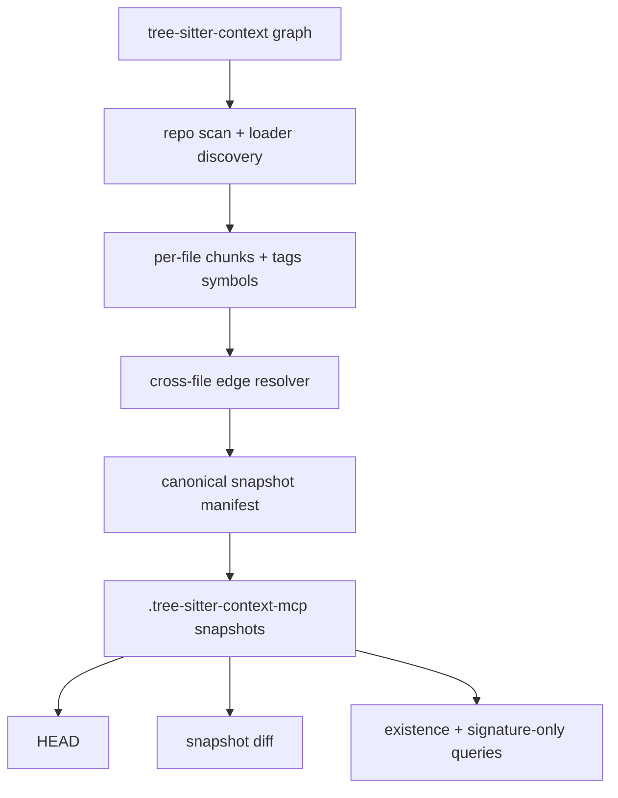
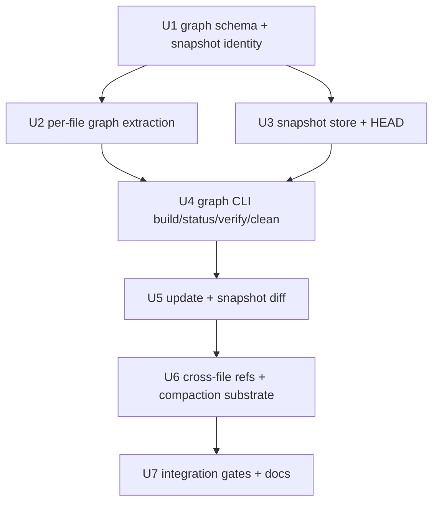

# feat: Add R1 repo map graph substrate

## Overview

This plan turns the R1 First-Class Repo Map requirements into an implementation sequence for a graph substrate under `tree-sitter-context`. R1 adds an additive `tree-sitter-context graph ...` namespace that can build, update, diff, verify, and clean repo graph snapshots without changing the completed R0 `tree-sitter-context bundle` contract.

The first implementation should be manifest-first: canonical JSON snapshots stored under `.tree-sitter-context-mcp/`, deterministic XXH3 snapshot IDs, and in-memory indexes for query/diff operations. SQLite remains a future materialized index for R3-scale query latency, not a prerequisite for R1 correctness.

---

## Problem Frame

R0 v1 proved a narrow `path + stable_id` bundle bridge and reserved `graph_snapshot_id` / `orientation_freshness` fields, but those fields still return `"unknown"` because no repo graph exists. R1 supplies the missing graph state: it scans supported files, extracts chunks and tags-backed symbols, records basic cross-file edges, writes deterministic snapshots, updates HEAD atomically, and exposes diff/query substrate needed by later R2/R3/v2 work (see origin: `docs/brainstorms/2026-04-26-r1-repo-map-requirements.md`).

The plan deliberately keeps R1 below the agent tool layer. It does not add `/find-callers`, `/find-defs`, impact-analysis tools, daemon mode, orientation injection, or graph-aware compaction runtime.

---

## Requirements Trace

- R1.1. Add an additive graph CLI namespace with `build`, `update`, `status`, `verify`, and `clean`, while preserving the R0 `tree-sitter-context bundle` v1 contract.
- R1.2. Build from repo root, scan supported files, respect ignore/generated-file policy, and use `tree-sitter-loader` for language discovery.
- R1.3. Prefer existing tags queries for symbols; missing tags config yields typed unsupported/degraded diagnostics, not fabricated empty truth.
- R1.4. Incremental update compares the previous HEAD snapshot to git/worktree changes and skips unchanged files by content hash.
- R1.5. Update marks dependent files for recheck through existing import/reference edges, with degraded confidence when dependency reachability is unknown.
- R1.6. Store each snapshot durably with repo-relative paths and a canonical snapshot manifest.
- R1.7. Compute deterministic XXH3 `graph_snapshot_id` from canonical graph state only.
- R1.8. Update `.tree-sitter-context-mcp/HEAD` atomically and keep the previous HEAD on failure.
- R1.9. Snapshot diff accepts two snapshot IDs and reports changed files, chunks, symbols, and edges with required buckets.
- R1.10. Diff records carry reason, strategy, confidence, old/new `path + stable_id`, and hash evidence; graph failures are typed.
- R1.11. Severe orientation change signals must return `postprocess_unavailable` when god-node/community postprocess data is absent, not false.
- R1.12. Graph node keys are collision-aware and never rely on bare global `stable_id`.
- R1.13. Cross-file resolver records definition/import/reference edges with `confirmed`, `ambiguous`, `unresolved`, or `unsupported` status.
- R1.14. Graph supports future compaction substrate queries for node existence/current signature and signature-only handles.
- R1.15. Do not implement v2 orientation injection, graph-aware compaction runtime, R3 query primitives, or daemon by default.

**Origin actors:** A1 R1 graph builder/updater, A2 tree-sitter loader + tags infrastructure, A3 graph store, A4 R0/pi-mono bridge consumer, A5 R2/R3 implementers, A6 operator/CI.

**Origin flows:** F1 cold graph build, F2 incremental update, F3 snapshot diff, F4 cross-file reference indexing, F5 R0 compatibility path.

**Origin acceptance examples:** AE1 graph build + HEAD, AE2 deterministic snapshot ID, AE3 body-only update diff, AE4 severe/postprocess diff behavior, AE5 typed store/schema failure, AE6 cross-file ambiguity, AE7 missing tags degradation, AE8 R0 compatibility, AE9 compaction substrate query, AE10 no daemon/runtime behavior.

---

## Scope Boundaries

- Do not change `tree-sitter-context bundle` flags, canonical S-expression output, result variants, or R0 pi-mono bridge behavior.
- Do not modify existing `tree-sitter context` JSON output semantics except where shared code must remain compatible.
- Do not implement v2 orientation prompt injection or pi-mono system prompt freshness logic.
- Do not replace or modify pi-mono `compact()` behavior.
- Do not expose R3 agent-facing tools such as `/find-callers`, `/find-defs`, `impact-analysis`, `shortest_path`, `safe_edit`, or semantic symbol search.
- Do not introduce daemon, MCP server, stdio JSON-RPC, N-API, or WASM bridge in R1.
- Do not promise LSP-grade type resolution, macro expansion, dynamic dispatch, build-system module resolution, or complete cross-package graph accuracy.
- Do not treat missing tags config, missing postprocess data, graph lock/corruption, or schema mismatch as "no refs" or "no changes".

### Deferred to Follow-Up Work

- SQLite/WAL materialized query index: defer until R3 query workload proves JSON snapshot + in-memory index is insufficient.
- God-node/community postprocess: defer unless needed for R1 diff output beyond `postprocess_unavailable`.
- R2 canonical symbol path and richer Provenance envelope: separate R2 plan.
- R3 query primitive tool surface: separate R3 plan.
- Daemon migration: only revisit if future measured workload fails the R12 gate that currently passed in `docs/plans/r0-context-firewall-performance-report-2026-04-26.md`.

---

## Context & Research

### Relevant Code and Patterns

- `crates/context/src/schema.rs` already defines serializable `ChunkRecord`, `SymbolRecord`, diagnostics, confidence, and invalidation records with stable JSON snapshot tests.
- `crates/context/src/identity.rs` now uses an explicit deterministic digest and duplicate-aware chunk matching; R1 must still avoid global bare `stable_id` keys.
- `crates/context/src/invalidation.rs` provides snapshot diff classification for one file using textual ranges plus stable identity matching.
- `crates/context/src/symbols.rs` wraps `tree_sitter_tags::TagsContext` and emits symbol diagnostics for tag failures and limits.
- `crates/context/src/bundle.rs` models included/omitted records and budget diagnostics; its typed omission style is a useful pattern for graph diagnostics.
- `crates/context/src/protocol.rs` and `crates/context/src/sexpr.rs` own the R0 Rust-side protocol and canonical serialization path.
- `crates/cli/src/bin/tree-sitter-context.rs` is the dedicated R0 binary; R1 should add `graph` subcommands here without changing `bundle`.
- `crates/cli/src/context.rs` shows the current loader-owned parse/symbol pattern for `tree-sitter context`.
- `crates/loader/src/loader.rs` exposes `find_all_languages`, `language_configuration_for_file_name`, and `LanguageConfiguration::tags_config`.
- `crates/cli/src/tests/context_bundle_test.rs`, `crates/context/tests/bundle_contract.rs`, and `crates/context/tests/sexpr_contract.rs` show the current R0 contract-test style.
- Workspace dependencies already include `serde_json`, `schemars`, `similar`, `walkdir`, and `tempfile`; adding graph work should follow workspace dependency conventions.

### Institutional Learnings

- `docs/solutions/workflow-issues/tree-sitter-context-branch-review-2026-04-25.md` records the core rule R1 must preserve: every agent-facing primitive needs explicit reason, strategy, confidence, and omissions/failure signals.
- `docs/plans/tree-sitter-context-hardening-implementation-plan-2026-04-25.md` keeps hardening separate from product expansion; R1 should not re-open those fixes unless graph integration reveals a regression.
- `docs/plans/tree-sitter-context-rfc-2026-04-24.md` emphasizes reusing parser, loader, tags, query APIs, and CLI patterns instead of building a new framework.
- `docs/plans/2026-04-26-001-feat-r0-context-firewall-plan.md` makes R1 a follow-up obligation, not a license to mutate R0's completed bridge.

### External References

- None used. The plan intentionally avoids new external service/API behavior and chooses local serde snapshots over SQLite for R1, so current local patterns are sufficient.

---

## Key Technical Decisions

- **Command namespace:** Use additive `tree-sitter-context graph <subcommand>`. Rationale: it lives beside the completed `bundle` binary contract and avoids introducing a second binary name before R1 proves value.
- **Store shape:** Use canonical JSON snapshot files plus an in-memory graph index for R1. Rationale: deterministic snapshot IDs and diff correctness are the primary R1 risks; SQLite can be a later performance cache without becoming the source of truth.
- **Core/CLI boundary:** Keep `crates/context` responsible for graph records, canonical snapshot identity, store validation, diff, and xref data structures; keep loader discovery, grammar paths, repo root resolution, and file scanning in `crates/cli`. Rationale: this follows the existing RFC boundary that core should not own loader state.
- **Snapshot identity:** Add an XXH3 implementation through a workspace dependency and hash canonical graph bytes only. Rationale: R0 explicitly requires deterministic XXH3; timestamps, absolute paths, DB row IDs, and iteration order must stay outside the hash input.
- **HEAD semantics:** Write snapshot files first, verify readability, then atomically replace `.tree-sitter-context-mcp/HEAD`. Rationale: v2 orientation will read HEAD at session start and cannot tolerate half-written state.
- **Graph command output:** Emit stable JSON on graph command success and keep process failures on non-zero stderr. Rationale: R1 commands are automation-facing and should follow the existing machine-readable `tree-sitter context` posture without weakening R0's stdout/stderr contract.
- **Diff semantics:** Treat missing postprocess data as `postprocess_unavailable`. Rationale: a false negative on severe orientation change is worse than an honest "not computed".
- **Cross-file resolution:** Start with tags-backed definitions/references plus import/module hints and explicit edge statuses. Rationale: R1 is infrastructure, not a type checker; ambiguity must be represented rather than hidden.

---

## Open Questions

### Resolved During Planning

- Graph namespace: use `tree-sitter-context graph ...`, not a separate `tree-sitter-context-mcp` binary.
- Graph store: canonical JSON snapshots are the source of truth for R1; SQLite is deferred as a future materialized index.
- Loader ownership: CLI owns loader/repo scanning; `crates/context` owns pure graph data and algorithms.
- Signature-only compaction substrate: R1 stores enough node signature metadata to answer current-signature queries without emitting R3 tool output.

### Deferred to Implementation

- Exact ignore/generated-file defaults: implement the smallest safe policy that uses repo-local evidence and exposes skipped files in status/diagnostics.
- Exact rename/move threshold: start with stable ID + signature/content hash evidence; tune only after characterization tests expose real ambiguity.
- Exact first-language coverage: Rust fixtures are required; additional languages can follow existing loader/tags fixture patterns if cheap.
- Exact graph JSON file names under `.tree-sitter-context-mcp/`: choose during implementation, but preserve HEAD atomicity and snapshot ID addressability.

---

## Output Structure

```text
crates/context/src/
  graph.rs
  graph/
    diff.rs
    snapshot.rs
    store.rs
    xref.rs

crates/context/tests/
  graph_snapshot_contract.rs
  graph_diff_contract.rs
  graph_xref_contract.rs

crates/cli/src/
  context_graph.rs
  bin/tree-sitter-context.rs
  tests/context_graph_test.rs

docs/plans/
  tree-sitter-context-graph-r1-contract.md
  r1-repo-map-performance-report-2026-04-26.md
```

This tree is a scope declaration. The implementing agent may collapse module files if the first pass is smaller, but the same responsibilities must remain explicitly covered.

---

## High-Level Technical Design

> *This illustrates the intended approach and is directional guidance for review, not implementation specification. The implementing agent should treat it as context, not code to reproduce.*



Snapshot files are canonical source-of-truth records. In-memory indexes are rebuilt from snapshots for diff and substrate queries. Future SQLite indexes may mirror snapshots but must not become the identity source unless the contract is revised.

---

## Implementation Units



- U1. **Graph schema and snapshot identity**

**Goal:** Add typed graph records and deterministic snapshot ID computation without introducing loader or CLI concerns into core.

**Requirements:** R1.6, R1.7, R1.10, R1.12; supports F1, F3, AE2, AE5

**Dependencies:** None

**Files:**
- Modify: `Cargo.toml`
- Modify: `crates/context/Cargo.toml`
- Modify: `crates/context/src/lib.rs`
- Create: `crates/context/src/graph.rs`
- Create: `crates/context/src/graph/snapshot.rs`
- Test: `crates/context/tests/graph_snapshot_contract.rs`

**Approach:**
- Define graph records around repo-relative `GraphFile`, `GraphNode`, `GraphEdge`, `GraphDiagnostic`, `GraphSnapshot`, and `GraphSnapshotId`.
- Use collision-aware node identity that includes repo-relative path plus stable ID and anchor/content evidence; do not expose bare `stable_id` as a global graph key.
- Define canonical snapshot ordering for files, nodes, edges, diagnostics, and schema version before computing the XXH3 digest.
- Keep timestamps and local absolute paths in operational metadata only, outside the snapshot hash.
- Add typed graph errors for missing snapshot, corrupted snapshot, schema mismatch, lock/write failure, and postprocess unavailable.

**Execution note:** Contract-test first. Write the snapshot serialization and hash determinism tests before filling in graph extraction.

**Patterns to follow:**
- `crates/context/src/schema.rs` for serde/schemars record style and snapshot assertions.
- `crates/context/src/protocol.rs` for Rust-owned protocol types.
- `crates/context/src/identity.rs` for length-delimited deterministic identity thinking.

**Test scenarios:**
- Happy path: two logically identical snapshots with files/nodes inserted in different orders produce the same canonical bytes and snapshot ID.
- Edge case: a snapshot built from a different checkout absolute path but the same repo-relative records produces the same snapshot ID.
- Error path: changing graph schema version changes the snapshot ID and verify reports a schema mismatch when expected/current versions differ.
- Regression: duplicate stable IDs in one file remain distinct graph nodes through path/anchor evidence.

**Verification:**
- Snapshot identity is reproducible, path-portable, schema-versioned, and independent of insertion order.

---

- U2. **Per-file graph extraction**

**Goal:** Convert parsed files into graph file/node/symbol records using existing chunk and tags infrastructure.

**Requirements:** R1.2, R1.3, R1.6, R1.12; supports F1, F4, AE1, AE6, AE7

**Dependencies:** U1

**Files:**
- Modify: `crates/context/src/graph.rs`
- Modify: `crates/context/src/graph/snapshot.rs`
- Modify: `crates/context/src/symbols.rs`
- Test: `crates/context/tests/graph_snapshot_contract.rs`

**Approach:**
- Add pure core helpers that accept repo-relative path, source bytes, chunks, optional symbols, parse diagnostics, and content hash, then produce graph file/node records.
- Keep tags optional: when tags are unavailable, the file still contributes parse/chunk records and carries an unsupported diagnostic.
- Record signature/content hashes separately so body-only changes can be distinguished from signature changes during diff.
- Preserve existing `ChunkRecord` and `SymbolRecord` shapes rather than inventing a parallel symbol model in R1.

**Execution note:** Use characterization fixtures around existing chunk/symbol output before adding graph-specific transformations.

**Patterns to follow:**
- `crates/context/src/chunk.rs` for chunk confidence and parse-error downgrade behavior.
- `crates/context/src/symbols.rs` for tags-backed symbol extraction and diagnostics.
- `crates/context/tests/bundle_contract.rs` for Rust parser fixture setup.

**Test scenarios:**
- Happy path: a Rust file with a function produces a graph file record, a graph node linked to its chunk, and a definition symbol record.
- Edge case: a parse tree with syntax errors still emits low-confidence chunk/node records and diagnostics.
- Edge case: missing tags config produces an unsupported/degraded diagnostic while preserving chunk records.
- Regression: same-name duplicate functions produce separate graph nodes and an ambiguity marker path for downstream relation keys.

**Verification:**
- Per-file extraction can represent supported, unsupported, degraded, and duplicate cases without fabricating refs.

---

- U3. **Snapshot store, HEAD, status, verify, and clean substrate**

**Goal:** Persist graph snapshots under `.tree-sitter-context-mcp/`, manage HEAD atomically, and expose store verification primitives for the CLI.

**Requirements:** R1.6, R1.8, R1.10; supports F1, F2, AE1, AE2, AE5

**Dependencies:** U1

**Files:**
- Create: `crates/context/src/graph/store.rs`
- Modify: `crates/context/src/graph.rs`
- Test: `crates/context/tests/graph_snapshot_contract.rs`

**Approach:**
- Store canonical snapshot JSON by snapshot ID and keep HEAD as a small text pointer to the active snapshot.
- Write snapshots through a temp file + atomic rename pattern; update HEAD only after the target snapshot verifies.
- Implement store verification that checks HEAD presence, target readability, schema compatibility, canonical hash match, and optional stale/dirty indicators supplied by the CLI.
- Implement clean as conservative garbage collection: remove unreachable snapshots only when HEAD remains valid.

**Execution note:** Characterize failure cases with temp directories before wiring CLI output.

**Patterns to follow:**
- Existing contract snapshot tests in `crates/context/src/schema.rs`.
- `tempfile`-backed test patterns in `crates/cli/src/tests/`.
- R0 CLI contract's strict success stdout / failure stderr separation in `docs/plans/tree-sitter-context-cli-v1-contract.md`.

**Test scenarios:**
- Covers AE1. Happy path: writing a snapshot creates a readable snapshot file and HEAD points to it.
- Covers AE2. Happy path: writing the same canonical snapshot twice preserves the same snapshot ID.
- Covers AE5. Error path: a simulated interrupted snapshot write leaves the previous HEAD intact.
- Error path: a corrupt snapshot file produces typed corruption/version diagnostics instead of being accepted.
- Edge case: clean removes unreachable snapshots without deleting the current HEAD target.

**Verification:**
- Store operations are atomic enough for single-worktree use and can distinguish missing, corrupt, stale, and valid graph states.

---

- U4. **Graph CLI build/status/verify/clean**

**Goal:** Add the user-visible graph command namespace and a cold build path that composes repo scanning, loader discovery, per-file extraction, snapshot storage, and HEAD updates.

**Requirements:** R1.1, R1.2, R1.3, R1.6, R1.8, R1.15; supports F1, F5, AE1, AE7, AE8, AE10

**Dependencies:** U2, U3

**Files:**
- Modify: `crates/cli/src/bin/tree-sitter-context.rs`
- Create: `crates/cli/src/context_graph.rs`
- Modify: `crates/cli/src/tests.rs`
- Create: `crates/cli/src/tests/context_graph_test.rs`
- Test: `crates/cli/src/tests/context_bundle_test.rs`

**Approach:**
- Add `graph build`, `graph status`, `graph verify`, and `graph clean` as subcommands of the existing `tree-sitter-context` binary.
- Keep `bundle` argument parsing and behavior untouched; graph commands are additive siblings.
- Let the CLI own repo root resolution, ignore/generated-file policy, file scanning, grammar path, loader setup, and tags config lookup.
- Build snapshots by feeding per-file parse/chunk/symbol results into the core graph API.
- Render graph command success as stable JSON with typed status values; reserve non-zero stderr for process-level failures.

**Execution note:** Add CLI compatibility coverage before wiring build, so R0 regressions are visible immediately.

**Patterns to follow:**
- `crates/cli/src/bin/tree-sitter-context.rs` for the existing dedicated binary and R0 `bundle` handling.
- `crates/cli/src/context.rs` for loader setup and tags config retrieval.
- `crates/cli/src/tests/context_bundle_test.rs` for CLI process tests.

**Test scenarios:**
- Covers AE1. Integration: running graph build on a Rust fixture repo creates HEAD and a snapshot with file/node/symbol records.
- Covers AE7. Integration: a recognizable file with no tags config is included with unsupported diagnostics, not silently omitted.
- Covers AE8. Regression: existing `bundle` unsupported-tier/format/path tests continue to pass after adding graph subcommands.
- Covers AE10. Regression: graph build/status does not start or require a daemon/background service.
- Error path: unreadable repo root or missing grammar reports a typed graph build failure without writing a new HEAD.

**Verification:**
- A cold graph build can be exercised from the CLI, and R0 bundle compatibility remains intact.

---

- U5. **Incremental update and snapshot diff**

**Goal:** Add graph update and diff behavior that can explain changed files, chunks, symbols, and edges between two snapshots.

**Requirements:** R1.4, R1.5, R1.8, R1.9, R1.10, R1.11; supports F2, F3, AE3, AE4, AE5

**Dependencies:** U4

**Files:**
- Create: `crates/context/src/graph/diff.rs`
- Modify: `crates/context/src/graph/store.rs`
- Modify: `crates/cli/src/context_graph.rs`
- Modify: `crates/cli/src/bin/tree-sitter-context.rs`
- Test: `crates/context/tests/graph_diff_contract.rs`
- Test: `crates/cli/src/tests/context_graph_test.rs`

**Approach:**
- Add `graph update` and `graph diff` on top of stored snapshots.
- For update, compare previous HEAD file records to current repo state by repo-relative path and content hash; re-extract changed files and mark deleted/missing files.
- Use existing graph import/reference edges as dependency hints. If dependency reachability is unknown, record degraded confidence instead of skipping.
- For diff, compare file records, node signature/content hashes, symbol records, and edge records into the required buckets.
- Return `postprocess_unavailable` when severe orientation classification would need god-node/community data that R1 has not computed.

**Execution note:** Start with fixed two-snapshot fixtures, then wire update to real worktree scanning.

**Patterns to follow:**
- `crates/context/src/invalidation.rs` for reason/strategy/confidence classification.
- `docs/plans/r0-orientation-compaction-v2-contract.md` for severe freshness constraints.
- `docs/brainstorms/2026-04-26-r1-repo-map-requirements.md` AE3/AE4 for expected diff semantics.

**Test scenarios:**
- Covers AE3. Happy path: body-only function edit returns modified chunk with content hash change, unchanged signature hash, reason, strategy, and bounded confidence.
- Covers AE4. Edge case: symbol rename returns removed/added or renamed_or_moved evidence and `postprocess_unavailable` when postprocess data is absent.
- Error path: diff with missing `from_snapshot_id` or schema-mismatched snapshot returns typed graph error.
- Edge case: deleted file removes its nodes and edges with explicit removed records.
- Regression: unchanged file content hash is skipped during update and remains unchanged in diff.

**Verification:**
- Update produces new snapshots without corrupting HEAD, and diff answers "which chunks changed" with auditable evidence.

---

- U6. **Cross-file references and compaction substrate queries**

**Goal:** Add the first honest cross-file relation layer and the minimum graph queries needed by future graph-aware compaction.

**Requirements:** R1.5, R1.12, R1.13, R1.14; supports F4, AE6, AE9

**Dependencies:** U5

**Files:**
- Create: `crates/context/src/graph/xref.rs`
- Modify: `crates/context/src/graph/snapshot.rs`
- Modify: `crates/cli/src/context_graph.rs`
- Test: `crates/context/tests/graph_xref_contract.rs`
- Test: `crates/cli/src/tests/context_graph_test.rs`

**Approach:**
- Build definition and reference candidate indexes from tags-backed `SymbolRecord`s and import/module hints available from the parsed files.
- Record graph edges with explicit status: `confirmed`, `ambiguous`, `unresolved`, or `unsupported`.
- Do not force a reference to a single definition when multiple candidates exist; preserve candidates in deterministic order.
- Add core query helpers for `path + stable_id -> exists/current signature` and `handles -> signature-only records`.
- Keep these helpers as substrate APIs, not R3 user-facing tools or pi-mono runtime integration.

**Execution note:** Keep the first resolver deliberately conservative; explicit ambiguity is a success path.

**Patterns to follow:**
- `crates/context/src/symbols.rs` for definition/reference extraction.
- `crates/context/src/protocol.rs` for signature-tier data already used by R0.
- `docs/brainstorms/2026-04-26-r0-context-firewall-requirements.md` R25 for compaction query obligations.

**Test scenarios:**
- Covers AE6. Happy path: `a.rs` references a public function in `b.rs`, producing a deterministic reference/import candidate edge.
- Covers AE6. Edge case: two same-name definitions produce an `ambiguous` edge with candidates, not a silent first match.
- Covers AE9. Happy path: a known `path + stable_id` returns exists plus current signature metadata.
- Covers AE9. Error path: after deletion/update, the same handle returns typed missing/stale record.
- Edge case: language without reference-capable tags produces `unsupported` relation diagnostics, not an empty confirmed graph.

**Verification:**
- Cross-file graph data is useful enough for later R3 and v2 compaction while remaining honest about ambiguous or unsupported resolution.

---

- U7. **Integration gates, performance report, and R1 contract documentation**

**Goal:** Freeze the R1 graph contract, prove compatibility with R0, and document operational behavior for future R2/R3/v2 implementers.

**Requirements:** R1.1 through R1.15; supports F1 through F5, AE1 through AE10

**Dependencies:** U6

**Files:**
- Create: `docs/plans/tree-sitter-context-graph-r1-contract.md`
- Create: `docs/plans/r1-repo-map-performance-report-2026-04-26.md`
- Modify: `docs/plans/r0-orientation-compaction-v2-contract.md` only if R1 discovers a real contract conflict
- Test: `crates/context/tests/graph_snapshot_contract.rs`
- Test: `crates/context/tests/graph_diff_contract.rs`
- Test: `crates/context/tests/graph_xref_contract.rs`
- Test: `crates/cli/src/tests/context_graph_test.rs`
- Test: `crates/cli/src/tests/context_bundle_test.rs`

**Approach:**
- Write a short R1 graph contract covering snapshot file shape, HEAD semantics, diff buckets, typed graph errors, and compatibility promises.
- Add an R1 performance report for cold build and update on representative fixtures; report parse, tags, snapshot serialization, and diff phases separately.
- Keep R0 bundle contract tests in the verification set so graph work cannot silently alter R0.
- Note any remaining deferred work explicitly for R2/R3/v2 rather than hiding it as implementation TODOs.

**Execution note:** Treat this as a release-readiness gate for the graph substrate, not polish.

**Patterns to follow:**
- `docs/plans/tree-sitter-context-cli-v1-contract.md` for compact contract-document style.
- `docs/plans/r0-context-firewall-performance-report-2026-04-26.md` for performance report format.
- R0 contract tests under `crates/context/tests/` and `crates/cli/src/tests/`.

**Test scenarios:**
- Covers AE8. Regression: R0 `bundle` contract tests pass unchanged after all graph work.
- Covers AE10. Regression: no graph command requires a daemon while R12 remains PASS.
- Integration: cold build -> status -> verify -> update -> diff works on fixture repo and preserves deterministic snapshot IDs.
- Error path: verify reports typed failures for corrupt snapshot, missing HEAD target, and schema mismatch.

**Verification:**
- The plan's acceptance examples have executable coverage or explicit documentation, and the R1 contract can serve as the handoff for R2/R3/v2 planning.

---

## System-Wide Impact

- **Interaction graph:** New graph commands sit in `tree-sitter-context` beside `bundle`; `crates/context` gains graph data APIs consumed by `crates/cli`, but pi-mono remains untouched.
- **Error propagation:** Core graph errors should remain typed through store/diff/xref APIs; CLI converts them to stable process failures or status records without stdout/stderr ambiguity.
- **State lifecycle risks:** `.tree-sitter-context-mcp/HEAD` must only point at complete snapshots; snapshot writes and cleanup must avoid deleting the active target.
- **API surface parity:** R0 `bundle` and existing `tree-sitter context` behavior remain compatible; graph commands are additive.
- **Integration coverage:** Unit tests prove schema/diff/xref behavior; CLI tests prove real command wiring and R0 compatibility.
- **Unchanged invariants:** No daemon, no MCP server, no pi-mono runtime changes, no R3 tools, and no global bare stable-id lookup.

---

## Alternative Approaches Considered

- **SQLite-first graph store:** Rejected for R1. It may be useful for R3 query latency, but it adds migration, locking, row-order determinism, and dependency surface before snapshot identity and diff semantics are proven.
- **Separate `tree-sitter-context-mcp` binary:** Rejected for R1. The existing `tree-sitter-context` binary is already the R0 integration point; an additive `graph` namespace keeps contracts closer and avoids premature MCP product framing.
- **Daemon-first graph service:** Rejected for R1. R0's subprocess latency gate passed, and no R1 workload evidence yet justifies a resident process.
- **Full language-server resolver:** Rejected for R1. Honest tags/import-backed relations with explicit ambiguity are enough to unblock R2/R3 planning without pretending to solve type-aware resolution.

---

## Dependencies / Prerequisites

- R0 v1 contract and tests remain the compatibility baseline.
- `crates/context` hardening work for deterministic identity, duplicate preservation, and honest token estimates is treated as present; regressions must be fixed before graph IDs depend on those records.
- An XXH3 crate must be added through workspace dependency conventions and covered by cross-platform golden fixtures.
- Fixture repos for graph tests must be small, repo-relative, and not depend on machine-local grammar paths.

---

## Risk Analysis & Mitigation

| Risk | Likelihood | Impact | Mitigation |
| --- | --- | --- | --- |
| Snapshot IDs drift across machines | Medium | High | Hash only canonical repo-relative snapshot bytes and add path-relocation tests. |
| HEAD points to a half-written snapshot | Medium | High | Use write-verify-atomic-replace flow and failure tests around interrupted writes. |
| Cross-file refs appear more precise than they are | High | High | Require edge status and confidence; ambiguity/unsupported are first-class outcomes. |
| Graph commands regress R0 bundle behavior | Medium | High | Keep R0 CLI and S-expression contract tests in final verification. |
| JSON snapshot becomes too slow for future R3 queries | Medium | Medium | Treat SQLite as deferred materialized index; keep canonical JSON source of truth now. |
| Ignore/generated-file policy misses important files or indexes too much | Medium | Medium | Start conservative, expose skipped/degraded counts in status, and leave exact tuning to implementation fixtures. |
| Postprocess signals are unavailable but needed by v2 | High | Medium | Return `postprocess_unavailable` explicitly and defer god-node/community computation. |

---

## Documentation / Operational Notes

- Document graph snapshot contract in `docs/plans/tree-sitter-context-graph-r1-contract.md`.
- Add R1 performance report with phase timing, not only total runtime.
- Keep `.tree-sitter-context-mcp/` generated artifacts out of committed source unless a fixture explicitly needs checked-in snapshots.
- If R1 discovers an incompatibility with `docs/plans/r0-orientation-compaction-v2-contract.md`, revise that contract deliberately instead of silently changing semantics in code.

---

## Sources & References

- **Origin document:** `docs/brainstorms/2026-04-26-r1-repo-map-requirements.md`
- R0 implementation plan: `docs/plans/2026-04-26-001-feat-r0-context-firewall-plan.md`
- R0 CLI contract: `docs/plans/tree-sitter-context-cli-v1-contract.md`
- R0 v2 contract: `docs/plans/r0-orientation-compaction-v2-contract.md`
- R0 performance report: `docs/plans/r0-context-firewall-performance-report-2026-04-26.md`
- Branch review learning: `docs/solutions/workflow-issues/tree-sitter-context-branch-review-2026-04-25.md`
- Relevant code: `crates/context/src/schema.rs`, `crates/context/src/identity.rs`, `crates/context/src/invalidation.rs`, `crates/context/src/symbols.rs`, `crates/cli/src/bin/tree-sitter-context.rs`, `crates/cli/src/context.rs`
